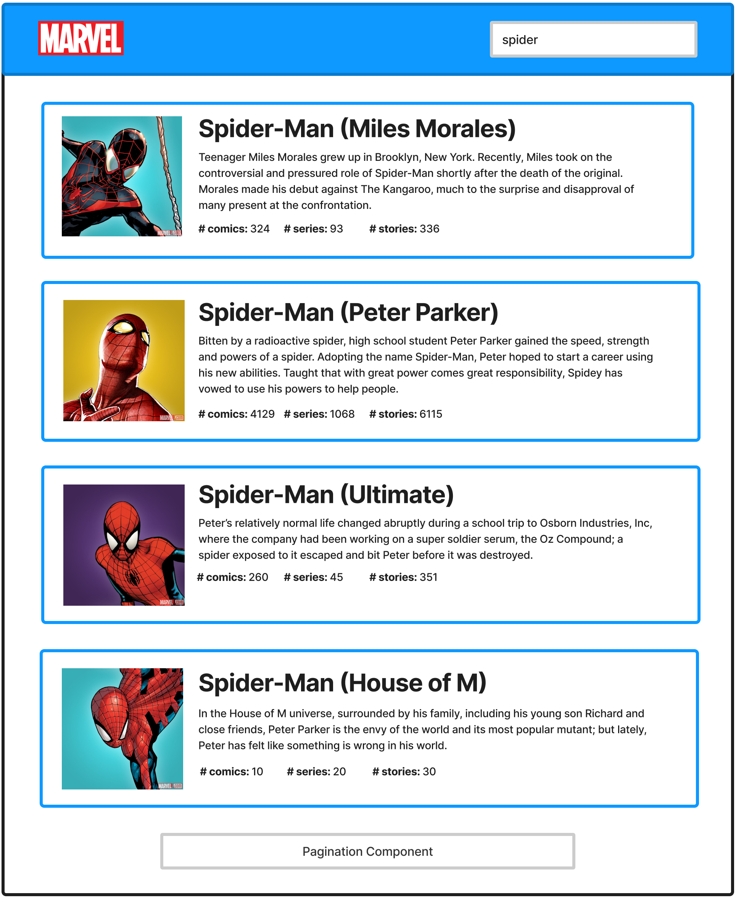

# LumApps Frontend Test

## Introduction

Welcome to the LumApps Frontend Technical Test. In this test, the candidate will need to create a small frontend application using the technologies that we at LumApps use in our daily routine.

## What is the candidate going to develop?

### Description 

In this technical test, the idea is to create a simple frontend application that retrieves data from a server and renders a list of entities. The candidate will be using Marvel's API in order to list the different superheroes and supervillains, and the candidate needs to allow the user to search for a character based on their name. The main page should:
- On start up, show an empty page with no results
- When the user searches for a superhero, by typing on the Search field, and hits enter, a list of 4 results will be displayed. The results displayed should display superheros where their name starts with the text entered by the user on the Search field.
- At the bottom of the page, if there are more results, a simple pagination system will be displayed, that will allow the user to see more results.

### Mockup

Below you will find a low fidelity mockup of the application which should give the idea of how the application should work. This does not mean that the candidate's test needs to be exactly identical to the design, this test will not evaluate the candidate's skill to create web applications that are pixel perfect. However, a general coherence in terms of style, spacing and sizes will be evaluated.

Each result displays:
- Character's image
- Character's name
- Character's description
- Character's total amount of comics, series and stories where it appears.

The Pagination component should be present at the bottom of the page. It is the candidate's responsibility to define the design of this component and how it works. The requirement for it is that it allows the user to navigate between pages

### Acceptance criteria

For this test to be completed, the candidate's application should:
- Allow the user to search for marvel characters by their name
- Display a list of 4 results, each of them with an image, title, description and amount of comics, series and stories
- A pagination component that allows the user to navigate between pages.

These features are what LumApps requires for considering this test as a complete one and the candidate should focus on having these features developed before developing additional features, functionality should be the focus of the test. If the search or the pagination features do not work or are not developed, the test will be considered as incomplete and it will affect the final review.

The candidate should not control how much time they are taking to fulfill the test. Each candidate can take as long as they want (as long as it is within the reasonable timeframe of LumApps recruitement scheduling), but the amount of time that the candidate takes will not affect the evaluation of the test itself.

## What will be evaluated?

The objective of this test is to evaluate different topics of frontend development. Specifically:
- The level of expertise that a candidate has with the web stack, which includes HTML, CSS and JavaScript, and how the candidate uses these languages in order to solve a problem.
- The level of expertise when it comes to JavaScript and React in general. 
- The attention that the candidate has for the general quality of the application. Specifically in terms of:
    - Accessibility
    - Performance
    - Usability and visual coherence
    - Maintainability
    - Edge case management

## Stack

In this test, we encourage the candidate to use the technologies that we use in our daily basis:
*   HTML
*   JavaScript
*   React JS
*   SCSS
*   Yarn
*   Webpack and Webpack Dev Server

If the candidate wants to use other technologies or add features in order to enhance their application (such as TypeScript, Redux, Jest, Enzyme, responsive design), they can do so.

As for using a components library, the candidate has multiple choices:
- If the candidate already knows and uses a specific React components library, they can use it and save sometime on the development process.
- If the candidate does not know any library, they can use the following: [https://github.com/lumapps/design-system](https://github.com/lumapps/design-system). This is an open source library created by LumApps and that we use in our current product. The candidate can access the library's documentation by going to https://design.lumapps.com/.

For the API that the candidate will be using, the candidate will need to consume Marvel's Open API to retrieve the different characters and their information. The candidate can take a look at the API and how to use it here:  
[https://developer.marvel.com/docs](https://developer.marvel.com/docs)

The candidate will need an API key in order to execute these requests. Please use the following one:  
`8fb61ed0d8ae4cc76943c8d2b8e2ed9c`

In order to use this API key, the candidate has to edit their `/etc/hosts` file, adding this line `127.0.0.1   develop.lumapps.com`.

### Ground rules

* We strongly suggest that the candidate uses the technologies suggested under the Stack section. If the candidate wants to use another technology such as Angular JS or Vue JS because they do not know React, they can do so, but they should take into consideration that we do not use them in our daily basis
* If the candidate wants to use their own boilerplate, they are free to override the whole repository, but the candidate should note that this could take more time than just using the provided boilerplate.

## Setup

The candidate should fork the repo and create their own, downloading it locally.

In the project directory, the candidate needs to run: `yarn`
This will setup the necessary dependencies to execute this project.

The candidate will need to use Node JS v.14 in order to run this project. Not doing so will result in an error. The candidate can install this particular version using [nvm](https://github.com/nvm-sh/nvm).

To start development, the candidate can execute `yarn start`, which will run the app in development mode.

Open [http://develop.lumapps.com:3000/](http://develop.lumapps.com:3000/) to view it in the browser.

## Project delivery

This project should be accessible on GitHub as either a private or public repository. The candidate's recruiter will provide further details when it comes to who to give access to the repository.
